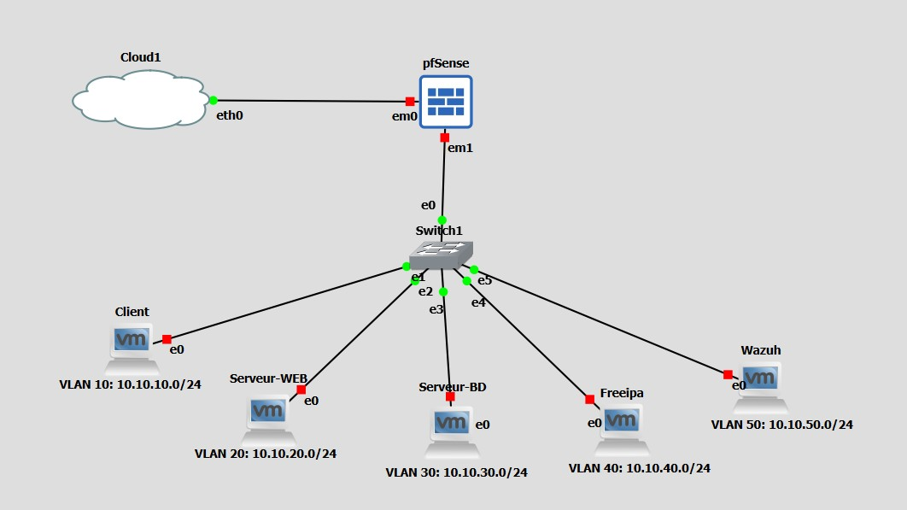

# Projet d'Architecture Zero Trust & Micro-segmentation

Ce dépôt contient la documentation complète et les ressources liées à la mise en œuvre d'une architecture réseau sécurisée de type **Zero Trust**, déployée dans un environnement virtualisé. Ce projet a été réalisé dans le cadre d'un cursus académique en informatique et cybersécurité.

## 📄 Documentation

Le cœur de ce projet est documenté dans le fichier suivant :
*   **[compte_rendu.pdf](./compte_rendu.pdf)** : Rapport détaillé (pas-à-pas) de l'installation, de la configuration et des tests de toute l'infrastructure.

## 🎯 Objectif du Projet

L'objectif principal est de démontrer comment sécuriser un système d'information on-premise contre les attaques (notamment les mouvements latéraux) en appliquant le paradigme **Zero Trust** : *"Never Trust, Always Verify"*.

L'architecture repose sur une **micro-segmentation** stricte du réseau, où chaque zone fonctionnelle (Utilisateurs, Serveurs Web, Base de Données, etc.) est isolée dans un VLAN dédié. Tout trafic entre ces zones doit obligatoirement transiter par le pare-feu central, qui inspecte et filtre les flux selon le principe du moindre privilège.

## 🏗️ Architecture du Système

Le réseau est organisé en topologie étoile autour d'un pare-feu central.

### Zones et VLANs
L'infrastructure est segmentée en 5 zones distinctes :

| VLAN ID | Zone | Description |
| :--- | :--- | :--- |
| **10** | **LAN / Utilisateurs** | Postes de travail des employés. Zone la moins sûre. |
| **20** | **DMZ WEB** | Serveurs frontaux (Web). Accessible depuis l'extérieur (simulé). |
| **30** | **DATA** | Zone critique contenant les bases de données (PostgreSQL). Isolée d'Internet. |
| **40** | **IDENTITY** | Serveur de gestion des identités (FreeIPA). Cœur de l'authentification. |
| **50** | **SIEM / Management** | Zone d'administration et de supervision (Wazuh). Accessible uniquement aux admins. |

## Technologies et Outils Utilisés

*   **pfSense** : Pare-feu open-source et routeur central. Il gère le routage inter-VLAN, le filtrage des paquets, et les services réseaux (DHCP, DNS, NTP).
*   **Wazuh** : Solution XDR et SIEM pour la détection d'intrusions, la surveillance de l'intégrité des fichiers (FIM) et l'analyse des logs en temps réel.
*   **FreeIPA** : Gestion centralisée des identités (Identity Management), fournissant des services LDAP et Kerberos pour l'authentification unifiée.
*   **PostgreSQL** : Système de gestion de base de données relationnelle, sécurisé et isolé dans sa zone dédiée.
*   **GNS3 & VirtualBox** : Outils de simulation et de virtualisation utilisés pour maquetter l'infrastructure réseau et héberger les serveurs.

## Fonctionnalités de Sécurité Implémentées

1.  **Micro-segmentation** : Isolation stricte des différentes couches applicatives (ex: le serveur Web ne peut parler à la base de données que sur le port 5432, rien d'autre).
2.  **Principe du Moindre Privilège** : Les règles de pare-feu sont configurées pour refuser tout trafic par défaut et n'autoriser que les flux strictement nécessaires.
3.  **Surveillance Active (SIEM)** : Déploiement d'agents Wazuh sur tous les nœuds pour remonter les alertes de sécurité et détecter les tentatives d'intrusion (ex: scans Nmap, brute force).
4.  **Défense en Profondeur** : Combinaison de la sécurité périmétrique (pfSense) et de la sécurité des terminaux (hardenning OS, agents Wazuh).

## Installation et Déploiement

Le déploiement complet est décrit dans le **[compte_rendu.pdf](./compte_rendu.pdf)**. En résumé :

1.  Configuration du commutateur (Switch) pour le support des VLANs (802.1Q).
2.  Installation de pfSense sur une machine virtuelle dédiée.
3.  Définition des interfaces et des sous-réseaux IP.
4.  Intégration des serveurs (Web, BDD, IPA) dans leurs VLANs respectifs.
5.  Application progressive des règles de filtrage.
6.  Installation et configuration du serveur Wazuh et déploiement des agents.

